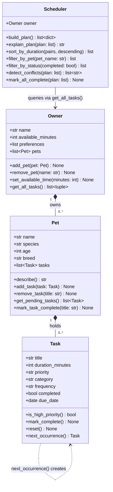

# PawPal+ Project Reflection

## 1. System Design

### Three Core User Actions

1. **Add a pet** — The user enters basic information about their pet (name, species, age, breed) so the system knows who it is planning care for.
2. **Add and manage care tasks** — The user creates tasks like "morning walk", "feeding", or "give medication", specifying how long each takes and how important it is (priority).
3. **Generate a daily schedule** — The user triggers the scheduler, which picks and orders tasks that fit within their available time, then displays a clear plan with reasoning for each choice.

**a. Initial design**

The system uses four classes:

- **Owner**: Holds the owner's name and how many minutes they have available today. Stores preferences (e.g., prefers morning tasks).
- **Pet**: Holds the pet's name, species, age, and breed. Linked to an Owner.
- **Task** (dataclass): Represents a single care task — title, duration in minutes, priority level, and category (walk, feeding, meds, etc.).
- **Scheduler**: Takes an Owner, a Pet, and a list of Tasks. Its `build_plan()` method filters and sorts tasks by priority, fits them within the owner's available time, and returns an ordered daily plan with explanations.

Relationships: Owner *has* Pets; Scheduler *uses* Owner + Pet + Tasks to produce a Plan.

**b. Design changes**

After reviewing the skeleton with AI feedback, one notable change was made:

- **Original**: `Scheduler` held a direct reference to a single `Pet` only.
- **Change**: `Owner` now maintains a `pets` list, and `Scheduler` references the `Owner` rather than a bare `Pet`. This makes the design more realistic — an owner may have multiple pets — and keeps ownership semantics correct without adding unnecessary complexity for the current scope.

---

## 2. Scheduling Logic and Tradeoffs

**a. Constraints and priorities**

The scheduler considers two constraints:

1. **Available time** — the owner's `available_minutes` acts as a hard budget. A task is only added to the plan if it fits within the remaining time.
2. **Priority** — tasks are sorted high → medium → low before the greedy selection pass. This ensures the most critical care (medication, feeding) is never bumped by lower-priority activities like grooming.

Time was treated as the hardest constraint because running out of time is a real-world limit that cannot be overridden by preference. Priority determines which tasks survive the cut when time is tight.

**b. Tradeoffs**

The scheduler checks for conflicts only on exact time-block overlaps (start < other_end AND other_start < end). It does not account for travel time between tasks or soft preferences like "don't schedule walks right after feeding."

This tradeoff is reasonable for a first version because it keeps the logic simple and predictable. A pet owner reviewing the generated plan can easily spot and adjust any ordering issues manually. Adding travel-time modeling or preference scoring would make the algorithm significantly harder to debug without adding much practical value at this stage.

---

## 3. AI Collaboration

**a. How you used AI**

AI was used across every phase of this project, but the role shifted as the work progressed:

- **Design phase**: Asked AI to critique the initial four-class structure and identify missing relationships. The most useful prompt pattern was _"Given these classes and responsibilities, what relationships or methods am I missing?"_ — it surfaced the `get_all_tasks()` cross-pet aggregation that the original skeleton lacked.
- **Implementation phase**: Used inline suggestions to generate method bodies for well-defined, mechanical logic (e.g., `sort_by_duration` using a `lambda` key, `timedelta` arithmetic for recurrence). Prompts that referenced the existing code (`"based on this class, implement..."`) produced more useful results than open-ended ones.
- **Testing phase**: Asked AI to generate an edge-case list for the scheduler, then hand-wrote each test from that list rather than accepting generated test code directly. This ensured every assertion reflected what the code was _actually supposed to do_, not just what it currently does.
- **Debugging**: When the Windows terminal raised a `UnicodeEncodeError` for the `○` symbol in `Task.__str__`, AI correctly diagnosed the `cp1252` encoding issue and suggested replacing the Unicode character with an ASCII alternative (`[ ]`).

The most helpful prompt pattern was: _"Here is my current implementation of X. What edge cases does it not handle?"_

**b. Judgment and verification**

One clear case where the AI suggestion was not accepted as-is: when asked to implement conflict detection, the first suggestion used a dictionary keyed by start time (`{start: task}`) and flagged any duplicate start time as a conflict. This approach missed overlaps where tasks start at different times but their durations overlap (e.g., a 30-minute task starting at minute 0 and a 10-minute task starting at minute 5).

The final implementation was rewritten to check whether any two time blocks satisfy `a_start < b_end AND b_start < a_end` — the standard interval overlap condition. This was verified by writing a test with a known-overlapping pair (`0–30 min` vs. `5–15 min`) and confirming the warning was produced, and a back-to-back pair (`0–20 min` vs. `20–30 min`) confirming no false positive.

---

## 4. Testing and Verification

**a. What you tested**

The test suite covers 35 behaviors across four layers:

- **Task**: `mark_complete`, `reset`, `is_high_priority`, and `next_occurrence` for all three frequency values (daily, weekly, as-needed). These are foundational — if recurrence logic is wrong, every downstream feature (auto-scheduling, UI display) is also wrong.
- **Pet**: `add_task`, `remove_task`, `get_pending_tasks`, and `mark_task_complete` with recurrence side-effects. Tested both happy path (task added and next occurrence appended) and no-recurrence path (as-needed tasks do not grow the list).
- **Owner**: `add_pet`, `set_available_time`, `get_all_tasks` across multiple pets.
- **Scheduler**: `build_plan` (priority ordering, time budget enforcement, completed exclusion), `sort_by_duration` (ascending, descending, immutability), `filter_by_pet` and `filter_by_status`, and `detect_conflicts` (overlap, exact-same-start, back-to-back non-conflict, empty plan).
- **Edge cases**: pet with no tasks, owner with no pets, zero available time, filtering by a name that doesn't exist.

These tests matter because the scheduler's outputs are only trustworthy if the primitives (Task state, recurrence, filtering) are correct first.

**b. Confidence**

**4 / 5** — Core behaviors and the most realistic edge cases pass. Two gaps remain:
1. No integration tests between `app.py` (Streamlit session state) and the logic layer — a broken import or session key mismatch would only show up at runtime.
2. Recurrence chains beyond a single next occurrence are not tested (e.g., completing three consecutive daily tasks and verifying dates are correct across all of them).

---

## 5. Reflection

**a. What went well**

The clearest success was separating concerns early: `pawpal_system.py` contains zero Streamlit code, and `app.py` contains zero scheduling logic. This made it straightforward to test the entire backend with pytest without needing a running browser, and made the UI changes in `app.py` surgical rather than risky.

**b. What you would improve**

The `Task` dataclass uses plain strings for `priority` and `frequency`. This works but means a typo like `"hig"` instead of `"high"` silently passes through to the scheduler and produces wrong sort order. In a next iteration, these fields would use `enum.Enum` so that invalid values are caught at object creation time rather than at runtime.

**c. Key takeaway**

The most important lesson was that AI is most useful _after_ you have a clear mental model, not before. When I asked AI to "build a scheduler," the suggestions were generic. When I asked it to "implement `sort_by_duration` on this specific `Scheduler` class using a lambda key on `duration_minutes`," it produced exactly what was needed. The human's job is to define the problem precisely enough that the AI's answer is useful — and to know enough to evaluate whether that answer is actually correct.
