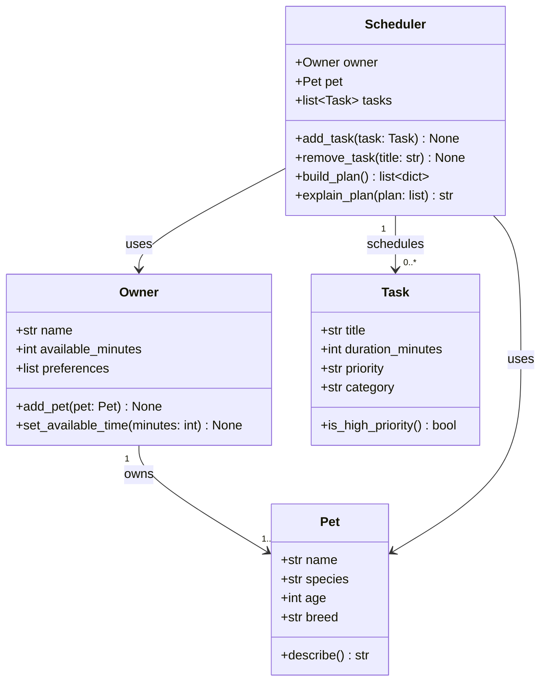

# PawPal+ Project Reflection

## 1. System Design

### Three Core User Actions

1. **Add a pet** — The user enters basic information about their pet (name, species, age, breed) so the system knows who it is planning care for.
2. **Add and manage care tasks** — The user creates tasks like "morning walk", "feeding", or "give medication", specifying how long each takes and how important it is (priority).
3. **Generate a daily schedule** — The user triggers the scheduler, which picks and orders tasks that fit within their available time, then displays a clear plan with reasoning for each choice.

**a. Initial design**

The system uses four classes:

- **Owner**: Holds the owner's name and how many minutes they have available today. Stores preferences (e.g., prefers morning tasks).
- **Pet**: Holds the pet's name, species, age, and breed. Linked to an Owner.
- **Task** (dataclass): Represents a single care task — title, duration in minutes, priority level, and category (walk, feeding, meds, etc.).
- **Scheduler**: Takes an Owner, a Pet, and a list of Tasks. Its `build_plan()` method filters and sorts tasks by priority, fits them within the owner's available time, and returns an ordered daily plan with explanations.

Relationships: Owner *has* Pets; Scheduler *uses* Owner + Pet + Tasks to produce a Plan.

**b. Design changes**

After reviewing the skeleton with AI feedback, one notable change was made:

- **Original**: `Scheduler` held a direct reference to a single `Pet` only.
- **Change**: `Owner` now maintains a `pets` list, and `Scheduler` references the `Owner` rather than a bare `Pet`. This makes the design more realistic — an owner may have multiple pets — and keeps ownership semantics correct without adding unnecessary complexity for the current scope.

---

## 2. Scheduling Logic and Tradeoffs

**a. Constraints and priorities**

- What constraints does your scheduler consider (for example: time, priority, preferences)?
- How did you decide which constraints mattered most?

**b. Tradeoffs**

- Describe one tradeoff your scheduler makes.
- Why is that tradeoff reasonable for this scenario?

---

## 3. AI Collaboration

**a. How you used AI**

- How did you use AI tools during this project (for example: design brainstorming, debugging, refactoring)?
- What kinds of prompts or questions were most helpful?

**b. Judgment and verification**

- Describe one moment where you did not accept an AI suggestion as-is.
- How did you evaluate or verify what the AI suggested?

---

## 4. Testing and Verification

**a. What you tested**

- What behaviors did you test?
- Why were these tests important?

**b. Confidence**

- How confident are you that your scheduler works correctly?
- What edge cases would you test next if you had more time?

---

## 5. Reflection

**a. What went well**

- What part of this project are you most satisfied with?

**b. What you would improve**

- If you had another iteration, what would you improve or redesign?

**c. Key takeaway**

- What is one important thing you learned about designing systems or working with AI on this project?
